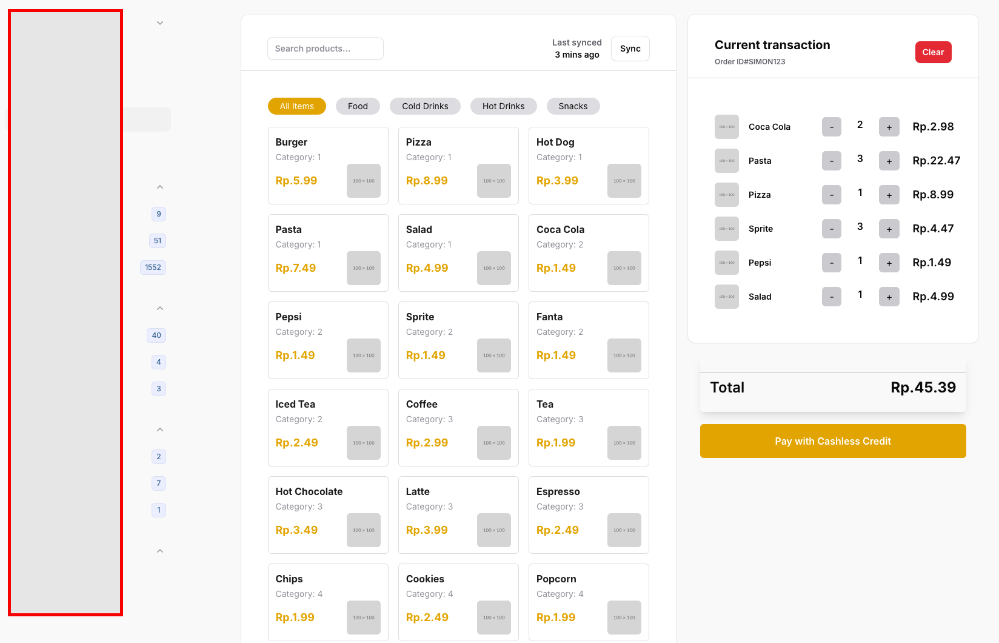

# POS System with FilamentPHP, TailwindCSS, AlpineJS, and Livewire

This repository contains Point of Sale (POS) ux system built using the following technologies:

- **[FilamentPHP](https://filamentphp.com/)**: A powerful Laravel admin panel builder, used for creating pages and managing UI components.
- **[Livewire](https://laravel-livewire.com/)**: A Laravel framework for building dynamic, reactive interfaces using server-side code.
- **[TailwindCSS](https://tailwindcss.com/)**: A utility-first CSS framework for designing modern and responsive UI.
- **[AlpineJS](https://alpinejs.dev/)**: A lightweight JavaScript framework used for client-side interactivity.
- **Laravel Framework**: Backend functionality and business logic.

This code and design come from https://www.creative-tim.com/twcomponents/component/point-of-sale-system
rebuild some parts and adjust using FilamentPhp Component and livewire

This code is just to play with Post ux and alphineJs
my goal is to adapt Ux with minimum sync with the server to improve seamless click events
